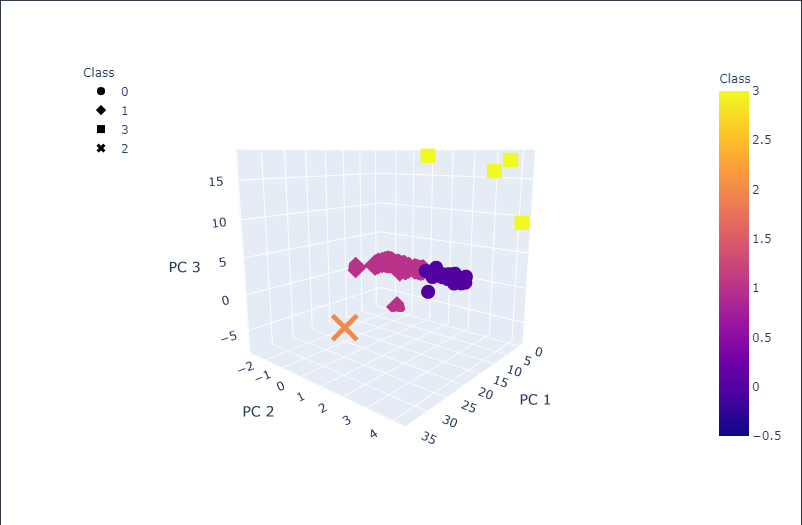
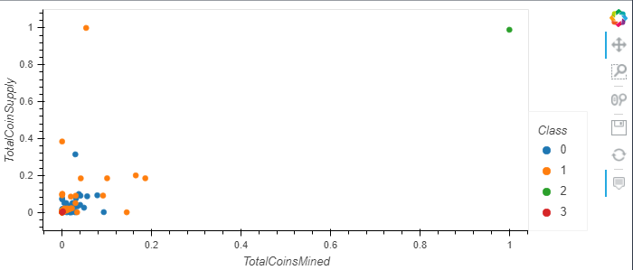

# Cryptocurrencies

## Challenge Overview
You are to create a report that includes what cryptocurrencies are on the trading market and how they could be grouped to create a classification system for this new investment. Since the data is not ideal, you will process it to fit unsupervised machine learning models. To group the cryptocurrencies, you will use a clustering alogritm then share the findings with data visualizations.

## Resources
- [crypto_data.csv](resources/crypto_data.csv)
- Software: Jupyter Notebook 6.0.3, Python 3.7.7, Visual Studio Code 1.51

## Challenge Results
We have found there to be **532** tradable cryptocurrencies.

| **3D Scatter** | **Scatter** |
|:----------------:|:---------:|
|  |  |